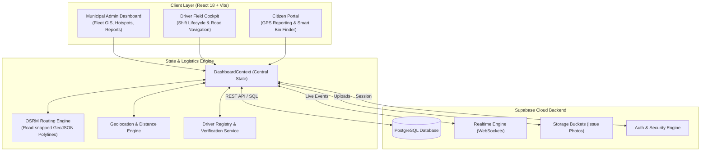
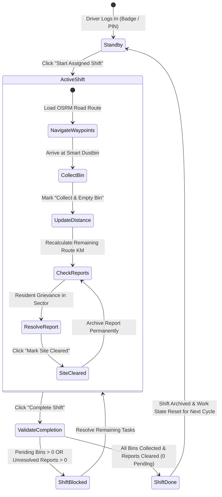
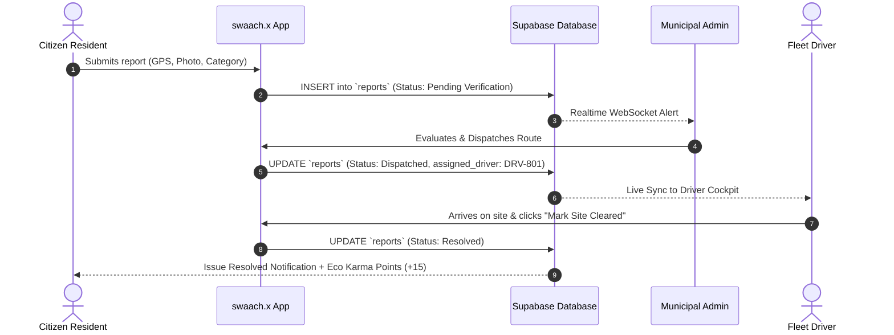
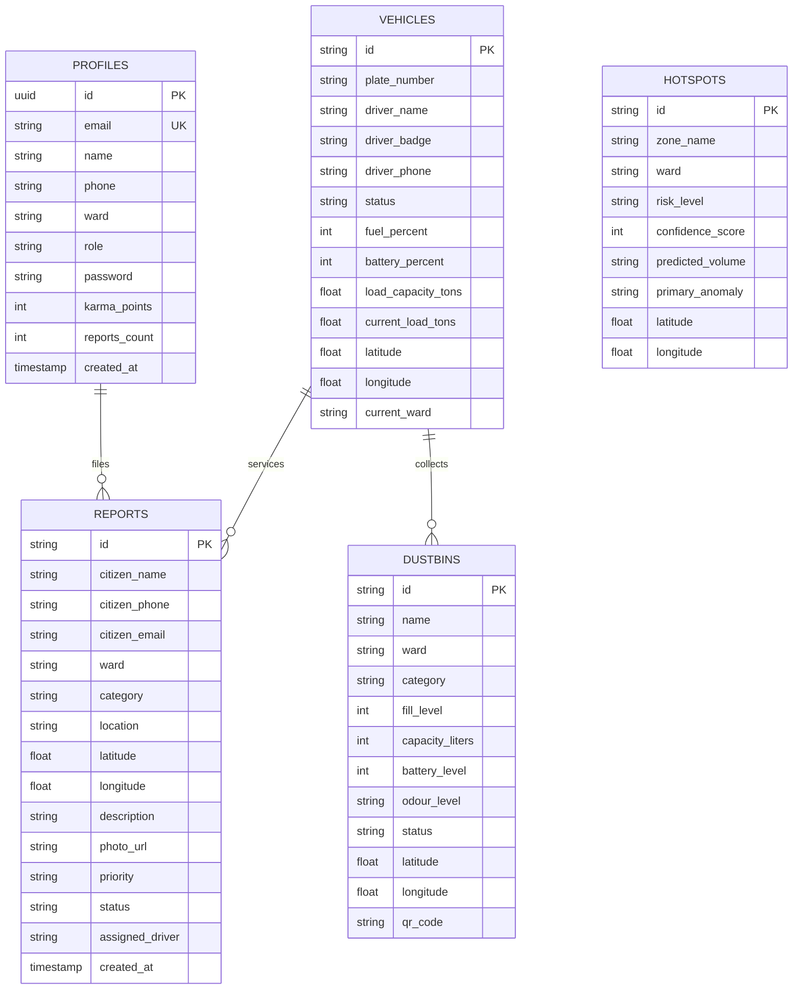

# 🌿 swaach.x — Smart Urban Waste Management & Logistics Platform (SIH PS 8)

---

## 📌 Part 1: Master Prompt Template
Copy and use the prompt below in any AI tool or document generator to retrieve comprehensive technical, operational, and architectural documentation for **swaach.x**:

```markdown
Act as a Principal Solution Architect and Technical Hackathon Lead. Provide an exhaustive, end-to-end technical overview and architectural design for "swaach.x", an AI-powered smart urban waste management and dynamic fleet logistics platform built for Smart India Hackathon (SIH PS 8).

Please cover:
1. Executive Summary & Problem Statement (Urban waste management bottlenecks in municipal corporations like Ahmedabad AMC).
2. Complete Tech Stack (React 18, Vite, Supabase PostgreSQL, OSRM Road Routing, Leaflet GIS, WebSockets).
3. System Architecture & Component Interactions (Frontend views, Context API state layer, Cloud database, Real-time channels).
4. Multi-Role User Workflows:
   - Municipal Admin/Officer (Fleet Telemetry, Hotspot AI Anomaly Detection, Route Generation, Report Redressal).
   - Municipal Fleet Driver (Shift Lifecycle, Road-Snapped Turn-by-Turn Waypoints, Smart Bin Collection, Sector Report Resolution).
   - Citizen Resident (GPS-enabled Issue Reporting, Smart Dustbin Locator, Eco-Karma Points).
5. Technical Algorithms & Logic:
   - Dynamic road routing via OSRM API with live distance decrement upon collection.
   - Shift completion guards (mandatory clearance of all assigned bins & citizen reports).
   - Database-backed authentication and fleet driver badge verification.
6. Mermaid Diagrams for:
   - High-Level System Architecture
   - Driver Shift Lifecycle & Route Execution State Machine
   - Citizen Grievance Redressal Flow
   - Database Entity-Relationship (ER) Schema
   - Turn-by-Turn Waypoint GIS Map Data Flow
```

---

## 🏛️ Part 2: Required System Diagrams

### 1. High-Level System Architecture Diagram


---

### 2. Driver Shift & Waypoint Execution State Machine


---

### 3. Citizen Issue Redressal & Field Dispatch Workflow


---

### 4. Database Entity-Relationship (ER) Schema


---

## 💻 Part 3: System Module Summary

| Module | Purpose | Key Technologies |
| :--- | :--- | :--- |
| **Driver Cockpit** | Shift management, turn-by-turn OSRM waypoint navigation, smart bin collection, real-time sector report clearing. | React 18, OSRM API, Geolocation, Leaflet |
| **Admin Operations** | Fleet tracking, ML waste hotspot prediction, AI route optimization, citizen ticket dispatch. | React-Leaflet, Supabase Realtime WebSockets |
| **Citizen Portal** | GPS camera reporting, smart bin navigation, eco-karma points, grievance resolution tracking. | HTML5 Geolocation API, Supabase Storage |
| **Authentication** | Dual-mode login (Citizen / Driver Badge), database password verification in `profiles` table, 6-digit Email OTP. | Supabase Auth, PostgreSQL RLS |
